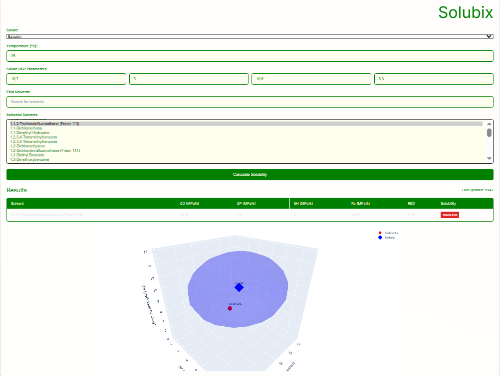

# Solubility Calculator for LLE extraction (Solubix)

[](https://www.python.org/)
[](https://flask.palletsprojects.com/)

A web-based application for calculating and visualizing solubility parameters using Hansen Solubility Parameters (HSP) theory. Features interactive 3D visualizations and temperature-dependent solubility predictions.



## Features

- **HSP Calculations**: Compute Hansen solubility distances (Ra) and Relative Energy Difference (RED)
- **3D Visualization**: Interactive Plotly 3D plot showing solvent positions and solute solubility sphere
- **Dynamic Selection**:
  - Predefined database of 150+ solvents and 30+ solutes
  - Custom solute parameter input
  - Multi-solvent comparison
- **Temperature Adjustment**: Simple temperature correction model
- **Responsive UI**: Clean modern interface with real-time results

## Installation

### Prerequisites
- Python 3.8+
- pip package manager

### Steps
1. Clone repository:
   ```bash
   git clone https://github.com/********/solubility-calculator.git
   cd solubility-calculator
2. Install dependencies:
   pip install flask numpy plotly
3. Run application:
   python app.py
4. Access in browser:
   http://localhost:5000

## Usage
1. Select Solute

- Choose from predefined solutes or enter custom HSP parameters:

    -- δD (Dispersion)

    -- δP (Polar)

    -- δH (Hydrogen bonding)

    -- Ro (Interaction radius)

2. Search/Select Solvents

- Type to search from 150+ solvents

- Ctrl/Cmd-click to select multiple solvents

3. Set Temperature

- Adjust temperature between 0-100°C

4. Calculate

- View results table with solubility status

- Explore interactive 3D visualization